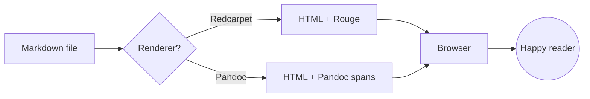
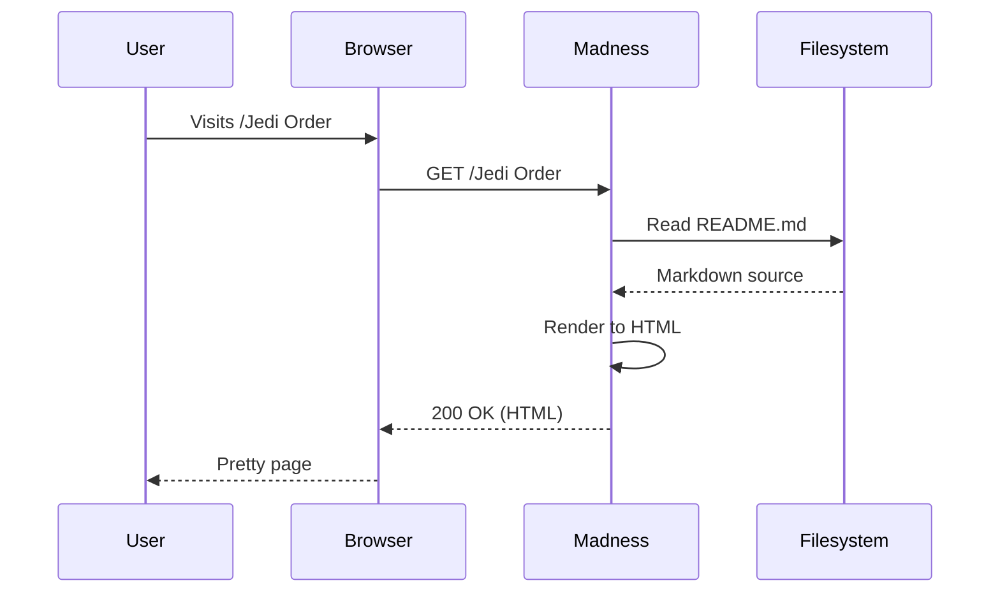
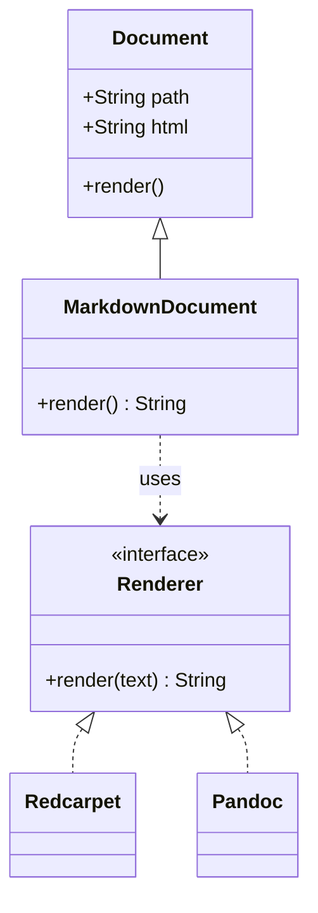
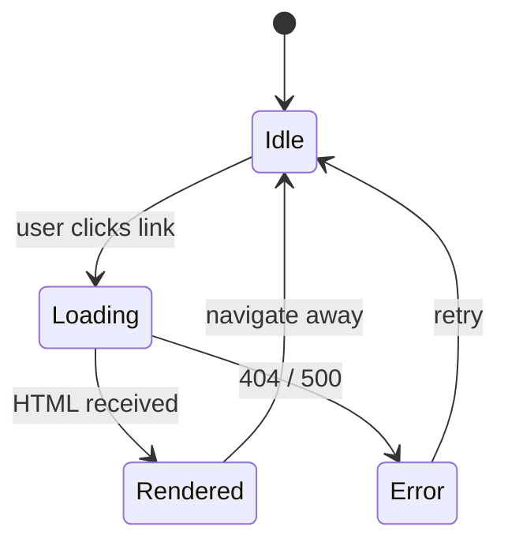
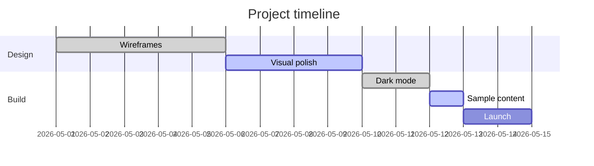
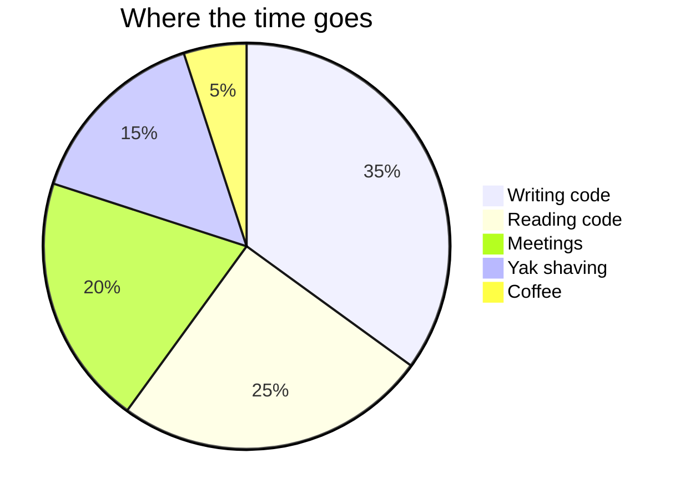

<!-- TOC -->

# Markdown Sample

A demonstration of every notable element Madness can render. Use this page
to eyeball typography, spacing, dark mode contrast, and diagram rendering
in one place.


## Headings

# Heading 1

## Heading 2

### Heading 3

#### Heading 4

##### Heading 5

###### Heading 6


## Paragraphs and text decorations

A paragraph of body copy. The quick brown fox jumps over the lazy dog. Long
prose should remain comfortable to read at 16px with a 1.7 line-height. A
second sentence keeps the rhythm going so we can judge whether the
descenders and ascenders are sitting where we expect them to.

- This is a **bold text**
- This is an *italic text*
- This is a ~~strikethrough text~~
- This is a ***bold italic text***
- This is an _underlined text_
- This is a _**bold underlined text**_
- This is a ==highlighted text==
- This is a ^superscript and ~subscript~
- This is `inline code` in a sentence
- This is a [link to the docs](https://github.com/DannyBen/madness "Madness on GitHub")


## Block quotes

> The best way to predict the future is to invent it.

A nested quote, with attribution:

> "Any sufficiently advanced technology is indistinguishable from magic."
>
> > And conversely, any sufficiently primitive magic is indistinguishable
> > from technology.
>
> — *Arthur C. Clarke (mostly)*


## Lists

### Unordered

- First item
- Second item
    - Nested item A
    - Nested item B
        - Deeply nested item
- Third item

### Ordered

1. Boot the server
2. Open the browser
3. Read the docs
    1. Skim the index
    2. Drill into a topic
    3. Profit
4. Ship something

### Task list

- [x] Wire up dark mode
- [x] Generate dark Rouge palette
- [x] Add Mermaid theming
- [ ] Add print stylesheet polish
- [ ] Write a blog post about it

### Definition list

Markdown
:   A lightweight markup language with plain-text formatting syntax.

Mermaid
:   A JavaScript-based diagramming tool that renders text definitions into
    SVG charts.

Rouge
:   A Ruby syntax highlighter, drop-in compatible with Pygments stylesheets.


## Code

Inline code looks like `array.map(&:to_s).join(",")` inside a paragraph.

### Ruby

```ruby
# A tiny greeter
class Greeter
  def initialize(name)
    @name = name
  end

  def say(message = "Hi")
    puts "#{message}, #{@name}!"
  end
end

Greeter.new("world").say
```

### JavaScript

```javascript
// Debounce — useful for search inputs.
function debounce(fn, ms = 250) {
  let t;
  return (...args) => {
    clearTimeout(t);
    t = setTimeout(() => fn(...args), ms);
  };
}

const onSearch = debounce((q) => console.log("searching", q), 300);
```

### Python

```python
from dataclasses import dataclass

@dataclass
class Point:
    x: float
    y: float

    def distance(self, other: "Point") -> float:
        return ((self.x - other.x) ** 2 + (self.y - other.y) ** 2) ** 0.5

print(Point(0, 0).distance(Point(3, 4)))  # 5.0
```

### Shell

```bash
# Start madness with a custom port
madness server --port 4567 --bind 0.0.0.0

# Watch logs
tail -f log/madness.log | grep -v healthz
```

### JSON

```json
{
  "name": "madness",
  "version": "0.18.0",
  "features": {
    "dark_mode": true,
    "search": true,
    "mermaid": true
  }
}
```


## Tables

A simple table:

| Language   | Paradigm        | Year |
|------------|-----------------|------|
| Ruby       | Object-oriented | 1995 |
| JavaScript | Multi-paradigm  | 1995 |
| Rust       | Systems         | 2010 |

With column alignment:

| Item        | Qty | Unit price | Total    |
|:------------|----:|-----------:|---------:|
| Widget      |   3 |     $4.50  |  $13.50  |
| Gizmo       |  12 |     $1.25  |  $15.00  |
| Doohickey   |   1 |    $99.00  |  $99.00  |
| **Total**   |     |            | **$127.50** |


## Images


## Keyboard shortcuts

Press <kbd>Cmd</kbd> + <kbd>K</kbd> to focus search. Press <kbd>Esc</kbd> to
close any modal. The shortcut <kbd>Ctrl</kbd> + <kbd>Shift</kbd> + <kbd>P</kbd>
opens the command palette in most editors.


## Horizontal rule

Content above the line.

---

Content below the line.


## Footnotes

Markdown supports footnotes for citations[^1] and side commentary[^math].

[^1]: This is a regular footnote with a backlink.
[^math]: Euler's identity, *e^(iπ) + 1 = 0*, is often called the most
    beautiful equation in mathematics.


## Mermaid diagrams

### Flowchart



### Sequence diagram



### Class diagram



### State diagram



### Gantt



### Pie


